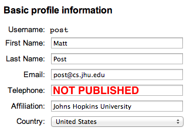

## Outline
{: .no_toc}

- TOC
{:toc}

## Entering paper metadata in START

It is very important that your paper's metadata (title, author names, and abstract) is entered correctly.
It is used on the conference website, handbook, mobile app, and the [ACL Anthology](https://aclanthology.org/) (and propagates to [DBLP](https://dblp.uni-trier.de), Semantic Scholar, Google Scholar, etc).

### Author names

You can enter your co-authors' names directly, or enter their START IDs.

- If you enter your co-authors' names directly, please *carefully read* the instructions below and check with each author to ensure that you enter their names correctly.

- Entering your co-authors' START IDs is strongly recommended, since it copies information from their global profiles. It also helps to disambiguate authors who have the same name. If you do this, please ensure that each author *carefully reads* the instructions below and updates their global START profile.

Your [global START profile](https://www.softconf.com/l/super/scmd.cgi?ucmd=updateProfile) looks like this:

When entering author names, please note carefully the following information:

* Unicode (UTF-8) can be used for accented or special characters.

* Names are **not** written in all caps or all lowercase ("Mitchell", not "MITCHELL" or "mitchell").

* The "Last Name" is the name(s) by which your paper is to be cited.
  It is usually a family name, even for authors from cultures where the family name is written first.
  If you have only one name, please enter it here.

* The "First Name" is usually a given name or names, including middle names/initials.

### Title and abstract

The title and abstract should be written using Unicode (UTF-8) with LaTeX commands.
Please try to follow these guidelines:

 - In titles, please capitalize the first word, the first word
   after a colon (`:`), and all other words except the following
   "little words": articles, prepositions, coordinating
   conjunctions, and the infinitive marker "to." This includes
   hyphenated words like `Mixed-Case`.

 - The ACL Anthology automatically detects most proper nouns and noun
   phrases that should always be capitalized. However, if your paper
   title contains a very uncommon proper noun, you can put curly
   braces around its first letter, like this:
   `{T}aumatawhakatangihangakoauauotamateaturipukakapikimaungahoronukupokaiwhenuakitanatahu`.
 
   Note that these curly braces will _not_ appear in the online
   conference program or proceedings. They will only appear in the
   BibTeX file that others will use to cite your paper.

 - If you need literal curly braces, please escape them with a backslash like this:
   `\{` `\}`

 - Please don't use any nonstandard LaTeX commands.

 - The title and abstract should not contains footnotes or citations.

 - You can use LaTeX math mode where appropriate: `An $O(n^2)$
   Algorithm for $n$-gram Smoothing`.

 - You can use Unicode (UTF-8) for accented or special characters.

 - Please don't copy-and-paste the abstract from your PDF file, but if
   you must, please be sure to rejoin words broken by hyphenation.

