Document originally written by Meg Mitchell, for ACL 2017, NAACL 2018, and ACL 2018, combining and building off of work and writing from Matt Post and the original ACLPUB instructions. Additional details provided by Stephanie Lukin after NAACL 2018. 

## Table of Contents
{: .no_toc}

- TOC
{:toc}

## tl;dr

You will be used softconf/START to generate your proceedings. Your goal is to get to the last step, Generate `All`, under the **Generate** tab, without any errors.
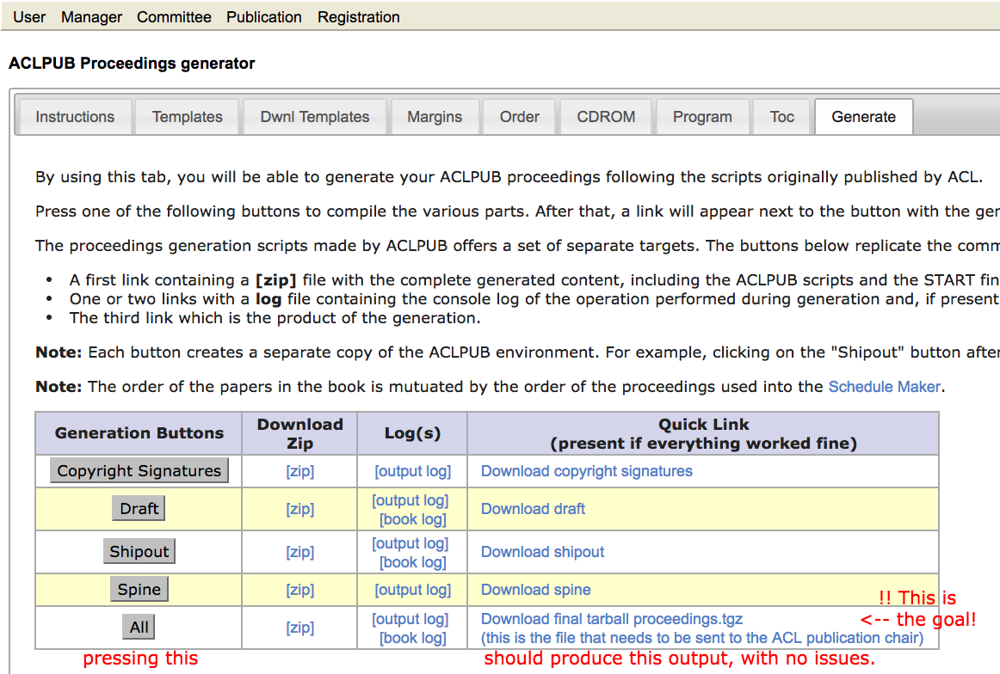

:point_right: :point_right: It has to look good and abide by the ACL paper and style guidelines. It's up to you to make sure it does. :point_left: :point_left: :ok_hand: :thumbsup:

### Important Details

1. Confirm with your Publication or Workshop chairs that they have the **precise name** of your workshop. Based on the workshop name, you will be provided an ISBN. 

1. Papers should be in A4 format.

1. Program times should be in 24-hour format.

1. *A note to Publication Chairs*: In the past, we have had success creating a spreadsheet with all the tracks and workshop information [like this one for NAACL 2019](https://docs.google.com/spreadsheets/d/1hSlqWCcTHZw-vaUQz-CBULIWtO99e0mNI8QP9sDohT0/edit?usp=sharing). From this spreadsheet, workshop titles can be confirmed, and ISBNs can be assigned by the ACL (via Priscilla Rasmussen).
Consider creating this yourselves, or coordinating with your Workshop Chairs on a combined spreadsheet.

## Introduction

You should be able to produce your proceedings entirely within the START manager console. Once your book builds without error using the `All` button under the Generate tab, let the publications chairs know by e-mailing the conference publication chairs. We will collect the books online using START. There is no need to e-mail us any zipped files.

We will update this page periodically with details and answers to frequently
asked questions as they arise. If you encounter any problems with this
process, you can email the conference publication chairs, but also remember this is all volunteer-run.

## Instructions

To get to the Softconf ACL Proceedings Generator: 
 - Go to your softconf website, e.g., https://www.softconf.com/acl2017/${WSAbbreviation}, where ${WSAbbreviation} is your Softconf abbreviation.
 - Go to the Publication Console (/pub):  https://www.softconf.com/acl2017/${WSAbbreviation}/pub
 - Under **Conference Program**, follow the `ACLPUB` link.   
   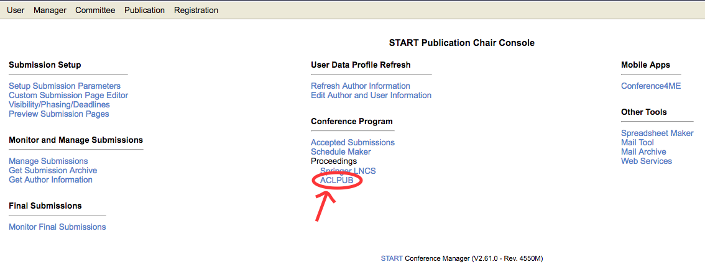
   This will bring you to the url:  https://www.softconf.com/acl2017/${WSAbbreviation}/pub/scmd.cgi?scmd=ACLPUB
 - Now you should see the `ACLPUB Proceedings Generator`.
   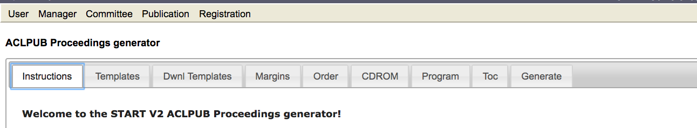

The Softconf ACL Proceedings Generator creates two things:

   -  **Book proceedings pdf, based in latex**   
   The files used in the generation of the book proceedings are shown in [Table 1](#table-1--files-used-in-book-proceedings-generation).

   -  **Online proceedings, based in html**
   Compiling the book proceedings end-to-end also produces the online proceedings.  The files used in the generation of the online proceedings are shown in [Table 2](#table-2--files-used-in-online-proceedings-generation).
   
Next we walk through how to use the Softconf ACL Proceedings Generator to create the book proceedings and the online proceedings.

__*If you'd prefer to edit files directly, go the [Expert Route](#expert-route).*__
      
### Table 1.  Files used in book proceedings generation.
   
| File              | Role in Proceedings |
| ----------------- | --------------------------- |
| `titlepage.tex`   | Title Page. |
| `copyright.tex`   | Copyright Page.  Where ISBN and Sponsor Logos go. |
|  `preface.tex`    | Preface Page.  Welcomes readers to the proceedings and gives some detail on the event. |
|  `organizers.tex` | Organizers Page.  Lists the organizing committee, program committee, invited speakers, panelists, etc. |
|  `toc.tex`        | Table of Contents Page.  This will be filled out automatically, but you can customize if you want. |
|  `program.tex`    | Schedule Page.  This too fill be filled out automatically, but you can customize if you want.|
|  `spine.tex`      | Book Spine, for use in the printed handbook. |
|  `citation-stamp.tex` | The Official Proceedings Footer that gives the citation details of the conference.  Appears on the bottom of the first page of each article in the proceedings. |   
| `order` | Determines the author ordering in the proceedings and the schedule. |
| `copyright-signatures` | Authors' copyright signatures, so the conference can print their work. |
   
### Table 2.  Files used in online proceedings generation.
   
| File              | Role in Proceedings |
| ----------------- | --------------------------- |
|  `index.html`      | Home page with list of papers and link to book proceedings. |
|  `program.html`    | Schedule Page, with links to papers.  This fill be filled out automatically based on the `order` file, but you can customize if you want.|
| `authors.html`| Page of the authors, with links to entries in `index.html`. |
| `order` | Determines the author ordering in `program.html`. |
| `copyright-signatures` | Authors' copyright signatures, so the conference can print their work. |

###  Table 3.  The tabs in the Softconf ACLPub Proceedings Generator.

| Tab Name           | What That Means                         | Files                                                    |
| ------------------ | --------------------------------------- | -------------------------------------------------------- |
| Templates          | Proceedings Front Matter Files          | *Book Proceedings Files*:  `titlepage.tex`, `copyright.tex`, `preface.tex`, `organizers.tex`, `citation-stamp.tex`, `spine.tex`, `book.tex` |
|                      |                                         | *Book Proc Header Files*:  `toc.tex.head`, `program.tex.head`, `cd.tex.head` |
|                      |                                         | *Online Proc Header Files*:  `index.html.head`, `authors.html.head`, `program.html.head`, `unified-authors.html.head` , `mainindex.html.head` |
| Dwnl Templates     | All Proceedings .tex and media files    | `.zip` files containing all `.tex` and media files, `order` file |
| Margins            | Margins                                 | All author `.pdf` files |
| Order              | Schedule & Author Ordering              | `order` file |
| CDROM              | THE MOST IMPORTANT TAB                  | `.html` files for online proceedings, and organization for the aclweb anthology's online pdfs. |
| Program            | Schedule - to Customize     | `program.tex` |
| Toc                | Table of Contents - to Customize                          | `toc.tex` |
| Generate           | Compile full proceedings                | `copyright-signatures`, `.tgz` file of book and online proceedings. |

# Step by Step Compilation in the Softconf ACLPUB Proceedings Generator

*Jump to Step:*

[1: Initial Generation](#step-1-generate-tab) &middot; 
[2: Margins](#step-2--margins-tab) &middot; 
[3: Dwnl Templates](#step-3--dwnl-templates-tab) &middot; 
[4: Templates](#step-4--templates-tab)  &middot;
[5: Order](#step-5--order-tab) &middot;
[6: Online Proceedings (CDROM)](#step-6--cdrom-tab-online-proceedings-tab) &middot; 
[7: Program](#step-7--program-tab) &middot; 
[8: TOC](#step-8--toc-tab) &middot; 
[9: Generate!](#step-9--generate-tab-trophy-trophy)

## Step 1: Generate Tab

### Step 1.1 Check Copyright Signatures

Your first job is to check that your authors signed their copyright forms via START. To create the `copyright-signatures` file, go on the **Generate tab**, and click on the **Copyright Signatures** button.

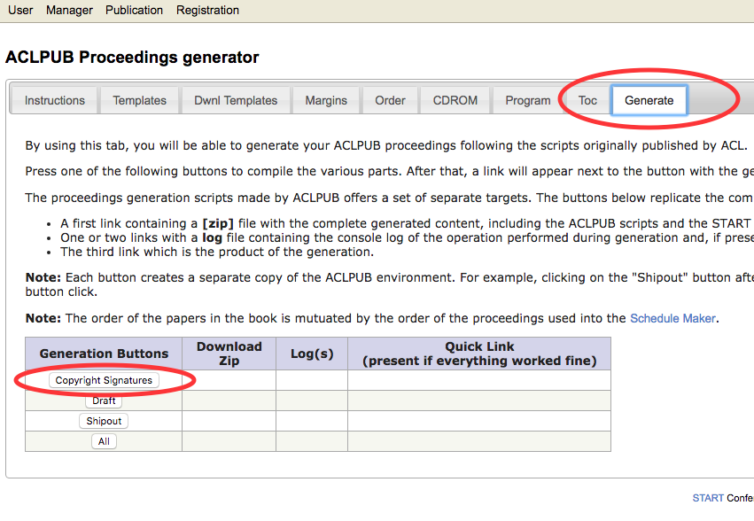

At this point, click on the "Download copyright signatures" link to download the copyright signatures.

DO NOT EDIT THIS FILE; it is a legal record. Please quickly review it to make sure that appropriate signatures have been provided for all papers. For any papers with missing, incomplete (e.g., initials) or inappropriate signatures (e.g., "Mickey Mouse"), contact the authors to get the proper copyright. Make sure that the authors' signed affiliation matches their START affiliation. If not, the author may need to update their information in START. They also may have performed the work while at a different affiliation from their current one. If this is the case, have them write a note in the affiliation box of the copyright form something like "This work done entirely while affiliated with XYZ" and provide the address for XYZ. 

If authors send you an externally signed copyright form, pass it along to the conference publication chairs, who will give it the ACL Anthology editor.

**Errors**: You may see a "Warning" message in the upper right corner of the website. This means that that authors have updated their START profiles (most commonly their affiliation). You will need to refresh in order for the changes to be reflected in the copyright signatures, and in the html `order` file later on.

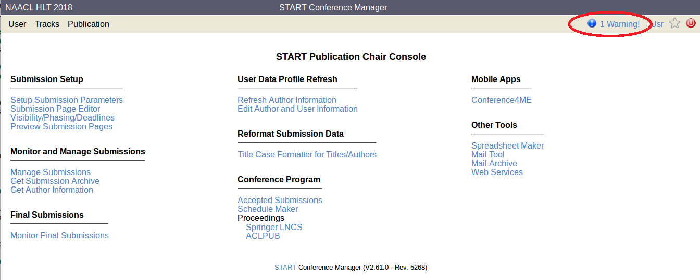

### Step 1.2 Get Rough Cut
Now **click on the Draft button**. 

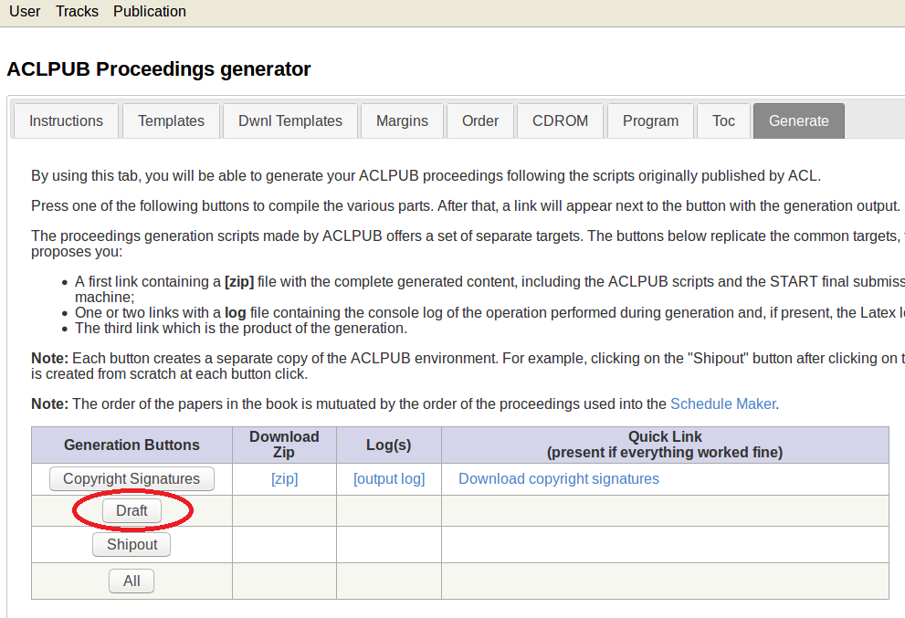

The command compiles all camera ready papers into a single pdf, adds margin markings and generates a first rough cut of the proceedings, `book.pdf`.  Click **Download Draft** to download after it is generated.

Count the papers to make sure you're not missing any (e.g., due to an author's failure to submit camera-ready copy).

**Errors**: If this or any of the other generation buttons in this tab fail (you will know, because a `zip` and `log` will appear, but not the `Download` quick link), check the log file to get a pointer to another, more specific log file, e.g,. program.log. This file will be located in the zip. Download it, and find the referenced log to see the actual issue. If you are unclear of the issue, email the publciation chairs. They have access to your softconf/START portal and can help debug the issue. 

### Step 1.3 Check and Fix PDF files

Flip through the rough cut.  
* Are the authors correct?  
* Is their contact information easily findable?  
* Is there an error or issue in how figures and tables show up?  
* Are things presented well for black-and-white?  
* Do all the fonts in the papers display and print correctly?  
* Did the authors follow the style file (font sizes, font faces, placement and style of captions)?  
* Is the paper within the page limits?  
* (We will deal with the margins in the next step)
* Etc...

If any of these things are amiss, you will need to ask the author to reupload a new final submission. If the submission portal is closed, have the authors email you a copy. You can upload it yourself by going to **Monitor Final Submissions**, then click **Get Final Form** for the paper in question. From "Monitor Final Submissions", you can also see the date and time when the authors last uploaded their versions. 

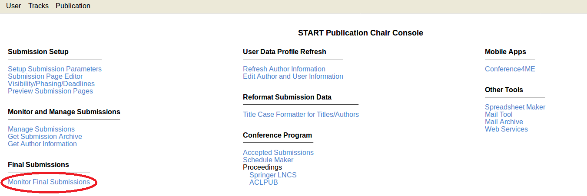

### Step 1.4 Check and Fix Paper Information

Now you will check that the information provided by authors are correct and correctly formatted. Clicking **Shipout** will generate a new version of the proceedings, but with an author index at the end and without the draft margin lines. 

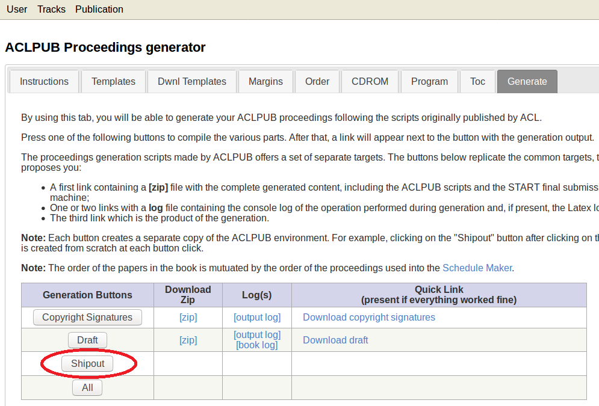

Please see the [Camera-Ready instructions under "Entering metadata"](final-version.md#metadata) for guidelines for author names, titles, and abstracts. Below are some additional instructions for chairs.

Look at the author index and ensure that:  
*   The guidelines in the [Camera-Ready instructions](final-version.md#metadata) are followed.
*   If an author uses their full name (not just their first initial) on the paper, their full name should appear in the index (i.e., "Doe, Jane" and not "Doe, J.").
*   There are no separate entries for "Doe, Jane" and "Doe, Jane X." That is, if the same author contributed to multiple papers, make sure their name is written the same way each time.

You can edit the way the author name appears in your proceedings using **Edit Author and User Information**. 

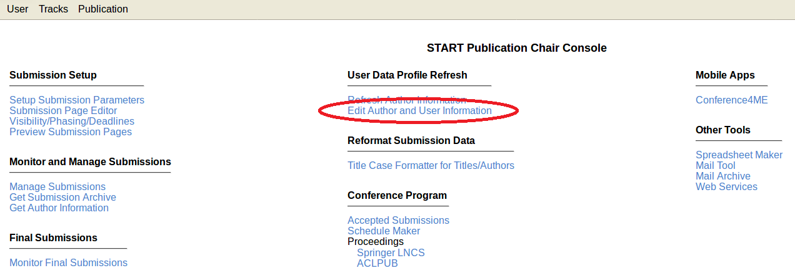
Additionally, look at the titles and abstracts and ensure that the guidelines in the [Camera-Ready instructions](final-version.md#metadata) are followed.

## Step 2:  Margins Tab
[Jump to Step 3](#step-3--dwnl-templates-tab)

When looking through the rough draft, if you noticed any papers are outside of the drawn margins, you need to change it here. 

Going to this tab should display a table of the first 10 papers.  To see all the papers, change the `Page length` value at the top of the table to the largest value possible.  

The draft book created in the last step includes a margin frame and rulers that should make it easy to detect how much each paper must be shifted to fit. 

The authors should have already checked their margins at submission time of thier final versions, but if they did not, you can edit it here. Look especially at page 2 of each paper. If the text doesn't fit within the frame, look at the top of the text to see how many millimeters it should be moved, and add a margin specification.

You can change margins in this tab by clicking on the cell all the way to the right -- this will bring up the Margins adjustment, circled in red image right :arrow_right:. 

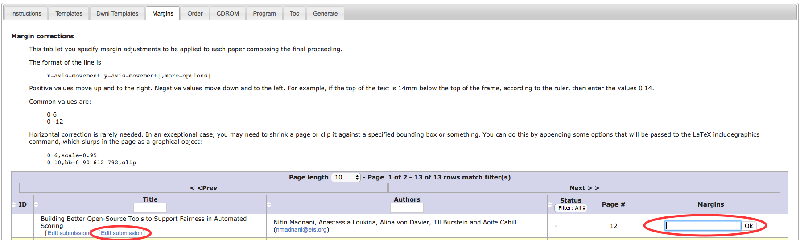

The format of the line is

> <pre>x-axis-movement y-axis-movement[,more-options]
> </pre>

Positive values move up and to the right. Negative values move down and to the left. For example, if the top of the text is `14mm` below the top of the frame, according to the ruler, then enter the values `0 14`.

Common values are:

> <pre>0 6
> 0 -12
> </pre>

Horizontal correction is rarely needed. In an exceptional case, you may need to shrink a page or clip it against a specified bounding box or something. You can do this by appending some options that will be passed to the [LaTeX includegraphics command](http://www.cs.brown.edu/system/software/latex/doc/grfguide.pdf), which slurps in the page as a graphical object:

> <pre>0 6,scale=0.95
> 0 10,bb=0 90 612 792,clip
> </pre>

After entering the margin movement information, you can regenerate the rough cut (just click on the `Draft` button in [the Generate tab](#step-1-generate-tab) again and check that everything is at the right place. Iterate until convergence.

Alternatively, for each paper, go to the left column and click on the rightmost `Edit Submission`.  This is circled in red image left :arrow_left:.  This will bring you to the authors' final uploaded paper, where you can take a look at the paper, and adjust the margins in the submission page for each.

## Step 3:  Dwnl Templates Tab 
[Jump to Step 4](#step-4--templates-tab)

This step is if you have logos and/or know what you are doing and want to edit your proceedings offline. If these do not apply to you, you may skip this step. 

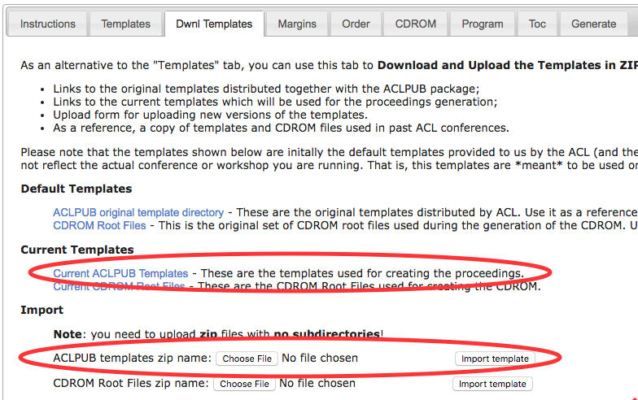
 
Download the ACLPUB `.zip` file, add in your sponsorship logos, rezip, and upload.  

To download all the current files, click on the "Current ACLPub Templates", circled here in red.  You will receive a zip file with all the files for your proceedings compilation.  If you don't want to use START, and know what you're doing, here is where you would upload all your files.

Once downloaded and unzipped, **you can edit all `tex` files here directly**.  You also add sponsorship logos here, via `\includegraphics` and 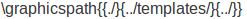, and referencing the images added to the directory.

When you are done, zip the edited directory back up again, and upload it again by clicking the `Choose File` button ("ACLPUB templates zip name"), the "Import template".

You can also edit all `.html` files using the CDROM `.zip`

## Step 4:  Templates Tab
[Jump to Step 5](#step-5--order-tab)

This is where you edit most of the front matter and online information for the proceedings. If you have imported a modified template from [Step 3](#step-3--dwnl-templates-tab), it will appear changed here. To check how well each part compiles, press the buttons in the Preview Templates table, then click on the Quick Link that is generated. 

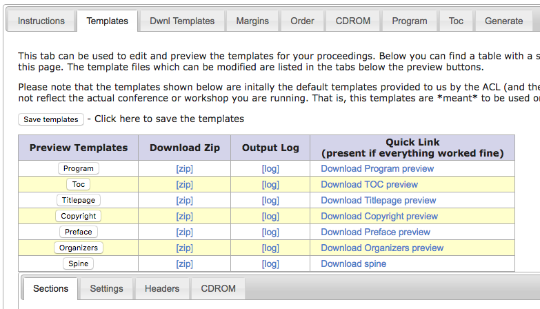

:point_right: :point_right: **Remember to hit `Save templates` at the top when you edit the embedded files.**

Select among the subtabs within this tab -- Sections, Settings, Headers, and CDROM -- to expose all the embedded files for editing.

<dl>
  <dt>Files to Edit in this Tab</dt>
  <dd>
      <dl>
      <dt>Book Proceedings</dt>
      <dd><b>Sections Subtab:</b>  `titlepage.tex`, `copyright.tex`, `preface.tex`,  `organizers.tex` </dd>
      <dd><b>Settings Subtab:</b> `citation-stamp.tex`, `spine.tex`, `book.tex`</dd>
      <dd><b>Headers Subtab:</b> `toc.tex.head`, `program.tex.head` </dd>
      <dt>Online Proceedings</dt>
      <dd><b>CDROM Subtab:</b> `index.html.head`, `authors.html.head`, `program.html.head`</dd>
      <dd>`unified-authors.html.head` (Publication Chairs Only), `mainindex.html.head` (Publication Chairs Only) </dd>
      </dl>
  </dd>
  
  <dt>Files Generated using the Headers Files</dt>
  <dd>
      <dl>
        <dt>Book Proceedings</dt>
        <dd> `program.tex`, check out by pressing the `Program` button.</dd>
        <dd> `toc.tex`, check out by pressing the `Toc` button.</dd>
        <dt>Online Proceedings</dt>
        <dd>`index.html`, `authors.html`, `program.html` </dd>
        <dd> `unified-authors.html` (Publication Chairs Only), `mainindex.html` (Publication Chairs Only)</dd>
      </dl>
  </dd>
</dl>

`program.tex` will follow what is given in the `order` file ([Step 5](#step-5--order-tab)).  You edit/customize `program.tex` in [the Program Tab (Step 7)](#step-7--the-program-tab), and you can edit/customize `toc.tex` in [the TOC Tab (Step 8)](#step-8--toc-tab).  For editing/customizing the HTML, you'll need to do it offline.

### Step 4.1 Title Page (Sections Subtab)

   [titlepage.tex](/acl-org/ACLPUB/blob/master/templates/proceedings/titlepage.tex) 

   Edit to reflect your title page. For uniformity, the following format is recommended for all workshops, demos, tutorials, etc:  
   * Acronym of the main conference, regardless of workshop (e.g., "NAACL HLT 2018")  
   * Title without iteration (e.g., "First", "Thirteenth") or 'Workshop of' 
   * Proceedings and the iteration; iteration not needed for main conference proceedings.
   * Some examples:
   
| Title | Proceedings | 
| ------------------ | --------------------------- |
| The 2018 Conference of the North American Chapter of the Association for Computational Linguistics: Human Language Technologies | Proceedings of the Conference Volume 1 (Long Papers) | 
| The 2018 Conference of the North American Chapter of the Association for Computational Linguistics: Human Language Technologies | Proceedings of the Demonstrations Session | 
| The 2018 Conference of the North American Chapter of the Association for Computational Linguistics: Human Language Technologies | Proceedings of the Student Research Workshop | 
| Innovative Use of NLP for Building Educational Applications | Proceedings of the Thirteenth Workshop | 

### Step 4.2 Copyright Page (Sections Subtab)

  [copyright.tex](/acl-org/ACLPUB/blob/master/templates/proceedings/copyright.tex) 

  Fill out the ISBN you received from your Publication or Workshop Chairs.  This is also where to use the \includegraphics tex call for sponsor logos, which we uploaded in [Step Two](#step-2--dwnl-templates-tab).

### Step 4.3 Preface Page (Sections Subtab)

  [preface.tex](/acl-org/ACLPUB/blob/master/templates/proceedings/preface.tex) 

The general introductory, welcome message from the organizers goes here.
  
### Step 4.4 Organizers Page (Sections Subtab)

  [organizers.tex](/acl-org/ACLPUB/blob/master/templates/proceedings/organizers.tex)
  
This is where you list all the people who made this possible -- Organizers, Program Committee, Advisory Board, Panel, etc.

### Step 4.5 Citation Stamp (Settings Subtab)

   [citation-stamp.tex](/acl-org/ACLPUB/blob/master/templates/proceedings/citation-stamp.tex)

This is the official citation for your proceedings, which gets stamped on the bottom of the first page of each author's work in your proceedings. Make sure the ciation stamp doesn't go into the margins (you can visually verify this in the generated **Draft** output. You can abbreviate your proceedings title, if you must shrink it). Make sure to change the date too.

### Step 4.6 Book (Settings Subtab)

   [book.tex](/acl-org/ACLPUB/blob/master/templates/proceedings/book.tex)

This is the main file enveloping your proceedings.

### Step 4.7 Program (Headers Subtab)

   [program.tex.head](/acl-org/ACLPUB/blob/master/templates/proceedings/program.tex.head)

Edit your program header if desired. 

### Step 4.8 TOC (Headers Subtab)

   [toc.tex.head](/acl-org/ACLPUB/blob/master/templates/proceedings/toc.tex.head)

Edit your Table of Contents header if desired.

### Step 4.9 HTML Pages (CDROM Subtab)

   [index.html.head](/acl-org/ACLPUB/blob/master/templates/proceedings/index.html.head)

   [authors.html.head](/acl-org/ACLPUB/blob/master/templates/proceedings/authors.html.head)

   [program.html.head](/acl-org/ACLPUB/blob/master/templates/proceedings/authors.html.head)
   
   [standard.css](assets/files/current_cdrom/standard.css)
  
These files are used to create the `index.html`, `authors.html`, and `program.html` files for the Online proceedings.  Edit the headers here so that they point to your conference/website.

## Step 5:  Order Tab
[Jump to Step 6](#step-6--cdrom-tab-online-proceedings-tab)
   
This tab creates the file called `order`.
 
**The `order` file is used to format and order the papers in the
proceedings, in the schedule, and also to generate the handbook, 
and populate the conference website and app.** 
The latter can be a
complex task, making sure that the schedule is formatted correctly and
consistently, and pulling together times across workshops (like the
student research workshop and the main proceedings). Since this is
done in LaTeX, it's important that the schedules be formatted to be
computer-readable.

You can either:
  1. Use the Schedule Maker, to figure out your schedule, and get the `order` file created from that. 
  2. Use the text in the textbox as the `order` file, editing directly using the given markup.

### Step 5a option: Edit `order` file with Schedule Maker tool
If you use the ScheduleMaker tool, the order file is generated automatically and should be to spec.

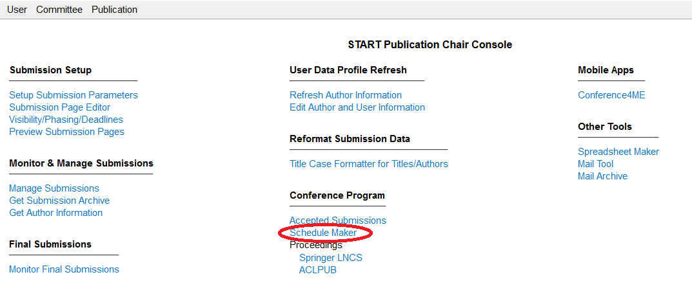

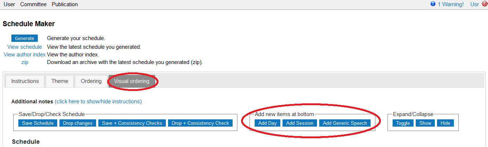

* The **Visual Ordering** lists all the papers accepted to your track. 
* Use the **Add Day** button to designate the day (a `*` will start this line in the generated order file)
* Use the **Add Session** for sessions, including morning/afternoon sessions, poster sessions, numbered sessions (a `=` will start this line in the generated order file)
* Rearrange the papers within each section. Expand the '+' and add a time. (the paper number will start this line in the generated order file)
* Use the **Add Generic Speech** for opening remarks, coffee breaks, lunch breaks, etc (a `!` will start this line in the generated order file)
* Don't use `&` or `#` in the titles for sessions and speeches

### Step 5b option: Edit `order` file manually
If you edit by the `order` file by hand, remember:
-  Times should be specified in 24-hour format (implicit AM/PM):

         ! 12:00--13:30 Lunch

**This is very important for things like the digital handbook!**

-  Time ranges should be fully specified, with two dashes in between (and no spaces). Don't put just the start time.

         17 9:00--9:30 # A really great paper

-  Do not put time ranges in parentheses

-  Can also make sure your file passes [this verification script](files/verify_order.py). E.g.,

         $ cat proceedings/order | python verify_order.py
         Found 0 errors

You can find the `order` file under the ACLPUB Proceednigs generator, and Order tab. 

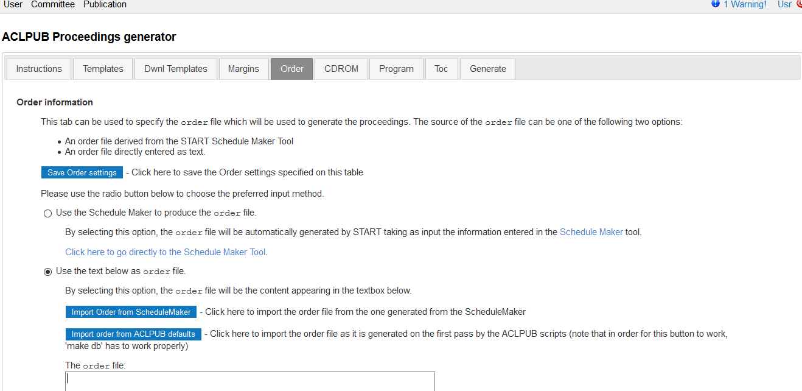

The  `order` file below is adapted from SSST-7 at NAACL 2013. You can use it as a template.  Remember to use a space, not a tab, to separate items on a line. 

      * Thursday, June 13, 2013
      ! 9:15--9:30 Opening Remarks

      = Session 1
      8 9:30--10:00 # A Semantic Evaluation of Machine Translation Lexical Choice
      6 10:00--10:30 # Taste of Two Different Flavours: Which Manipuri Script works better for English-Manipuri Language pair SMT Systems?
      ! 10:30--11:00 Break

      = Session 2
      7 11:00--11:30 # Hierarchical Alignment Decomposition Labels for Hiero Grammar Rules
      3 11:30--12:00 # A Performance Study of Cube Pruning for Large-Scale Hierarchical Machine Translation
      4 12:00--12:30 # Combining Word Reordering Methods on different Linguistic Abstraction Levels for Statistical Machine Translation
      ! 12:30--14:00 Lunch

      = Session 3
      ! 14:00--15:00 Panel discussion: Meaning Representations for Machine Translation, with Jan Hajic, Kevin Knight, Martha Palmer and Dekai Wu
      9 15:00--15:30 # Combining Top-down and Bottom-up Search for Unsupervised Induction of Transduction Grammars
      ! 15:30--16:00 Break

      = Session 4
      2 16:00--16:30 # A Formal Characterization of Parsing Word Alignments by Synchronous Grammars with Empirical Evidence to the ITG Hypothesis.
      5 16:30--17:00 # Synchronous Linear Context-Free Rewriting Systems for Machine Translation    

You may view an online version of your schedule from the Schedule Maker screen.

## Step 6:  CDROM Tab (Online Proceedings Tab)
[Jump to Step 7](#step-7--program-tab)

You will need to fill out this tab with the correct values for your volume. **Even though this tab is called 'CDROM', it is one of the most important tabs in the process as it is critical for uploading your proceedings to the anthology!**

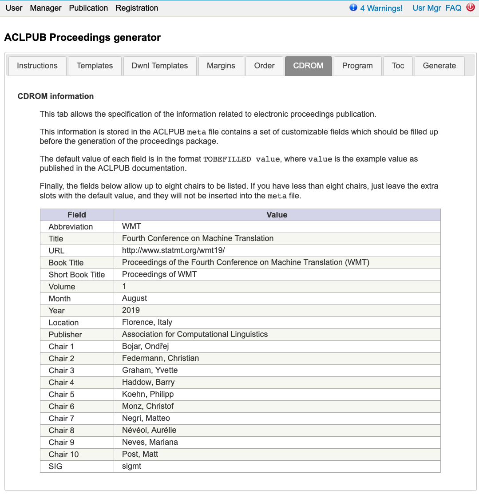

As an example, here are the values used for the ACL 2020 long paper main conference proceedings:

| Field           | Value                         |
| --------------- | --------------------------------------- |
| Abbreviation    | acl          |
| Title           | The 58th Annual Meeting of the Association for Computational Linguistics |
| URL             | https://acl2020.org/ |
| Book Title  	  | Proceedings of the 58th Annual Meeting of the Association for Computational Linguistics |
| Short Book Title |  Proceedings of the ACL |
| Volume          | 1 |
| Month           | July |
| Year            |  2020 |
| Location      	|  Seattle, Washington |
| Publisher	      |  Association for Computational Linguistics |
| SIG             |    |
| Chair 1        	|  Dan Jurafsky |
| Chair 2        	|  Joyce Chai |
| Chair 3        	|  Natalie Schluter |
| Chair 4        	|  Joel Tetreault |
| Chair 5        	|  TOBEFILLED-Jill Burstein (Educational Testing Service) |
| Chair 6        	|  TOBEFILLED-Jill Burstein (Educational Testing Service) |
| Chair 7        	|  TOBEFILLED-Jill Burstein (Educational Testing Service) |
| Chair 8        	|  TOBEFILLED-Jill Burstein (Educational Testing Service) |
| Chair 9        	|  TOBEFILLED-Jill Burstein (Educational Testing Service) |
| Chair 10        |  TOBEFILLED-Jill Burstein (Educational Testing Service) |

Note that, in 2020, the Anthology moved to a [new ID format](https://www.aclweb.org/anthology/info/ids/).
There is no longer any "Bibtex URL" for producing the Anthology ID; instead, the Anthology volume identifier is now formed as `{year}.{abbrev}-{volume}` (from the **Abbreviation**, **Year**, and **Volume** fields above).
These three constitute the volume ID (e.g., `2018.semeval-1`), which is prefixed to the paper ID to form the complete paper identifiers (e.g., `2020.acl-1.19` for the 19th paper in the first volume).

Please note the following restrictions on these fields:

- **abbrev** will be lowercased when forming file names.
  It can only contain ASCII letters and numbers ([A-Za-z0-9]+).
  Please be consistent with prior years.
  Your volume will appear under `https://aclweb.org/anthology/venues/{abbrev}`.
- **year** is the four-digit year.
- **volume** is the name of the volume.
  Most workshops have just a single volume, in which case you can just use "1".
  For larger conferences with multiple volumes, you may wish to choose short, informative names (e.g., "short" for short papers, "long" for long papers, "srw" for papers in a Student Research Workshop, etc.)

It important to ise  get these values correct and consistent with past venues.
You can consult the Anthology to see the abbreviation for past events.

The **Book Title** value should be the same as the **Title** but with "Proceedings of" at the beginning.
The main volumes (long, short, industry, papers, demos, SRW, tutorials) should share a similar title and book title, e.g,. 

> Title: The 2018 Conference of the North American Chapter of the Association for Computational Linguistics: Student Research Workshop  
> Book Title: Proceedings of the 2018 Conference of the North American Chapter of the Association for Computational Linguistics: Student Research Workshop  
> Short Book Title: Proceedings of the NAACL 2018 Student Research Workshop  

and

> Title: The 2018 Conference of the North American Chapter of the Association for Computational Linguistics: Demonstrations  
> Book Title: Proceedings of the 2018 Conference of the North American Chapter of the Association for Computational Linguistics: Demonstrations  
> Short Book Title: Proceedings of the NAACL 2018 Demonstrations  

An example of a workshop:

> Title: The Thirteenth Workshop on Innovative Use of NLP for Building Educational Applications
> Book Title: Proceedings of the Thirteenth Workshop on Innovative Use of NLP for Building Educational Applications
> Short Book Title: Proceedings of BEA

**Note:** The format of the titles in the CDROM tab are different from how it is printed on `titlepage.tex` on purpose.

## Step 7:  Program Tab
[Jump to Step 8](#step-8--toc-tab)

Customize your book proceedings Program `program.tex` here.  This is generated automatically in the Templates tab, when you click the  `Program` button.  See [Step Five](#step-5--templates-tab). If you are not satisfied with the apperaance of the automatic generation, you may edit it further here. Otherwise, you may skip this step. 

Note: If you create a custom program **make sure that the order file matches the custom program**. The order file is what is used for the handbook and the website/app, so it must contain the correct information.

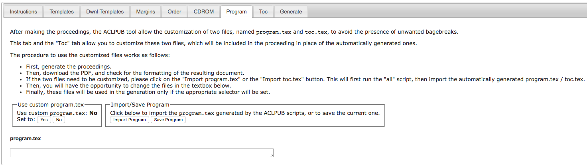

## Step 8:  Toc Tab
[Jump to Step 9](#step-9--generate-tab-trophy-trophy)

Customize your `toc.tex` here.  This is generated automatically in the Templates Tab, when you click the `Toc` Button.  See [Step Five](#step-5--templates-tab). If you are not satisfied with the automatic generation, you may edit it further here. Otherwise, you may skip this step.

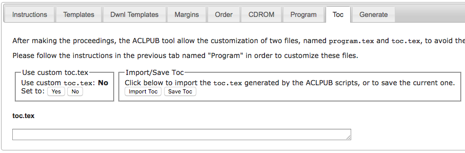

## Step 9:  Generate! Tab :trophy: :trophy:

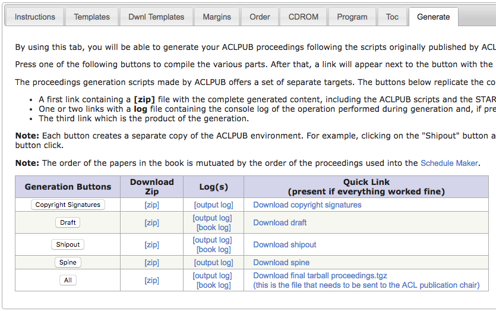
   
Push these buttoms, top to bottom, in order.   If one of them doesn't compile, check out the error log to see why and debug.
Once you can compile `All` without errors, you are done! :balloon: :balloon:

---
*Go back to Step:*

[1: Initial Generation](#step-1-generate-tab) &middot; 
[2: Margins](#step-2--margins-tab) &middot; 
[3: Dwnl Templates](#step-3--dwnl-templates-tab) &middot; 
[4: Templates](#step-4--templates-tab)  &middot;
[5: Order](#step-5--order-tab) &middot;
[6: Online Proceedings (CDROM)](#step-6--cdrom-tab-online-proceedings-tab) &middot; 
[7: Program](#step-7--program-tab) &middot; 
[8: TOC](#step-8--toc-tab) &middot; 
[9: Generate!](#step-9--generate-tab-trophy-trophy)

## Non Archival Papers
Read this if your track or workshop will have non-archival papers. 

Of course, non-archival papers are **not included in the proceedings** so there are some tricks we must take when dealing with them. 

If you want your non-archival papers to appear in the schedule that is printed in the handbook, listed on the website and conference app, follow these instructions. 

1. Ensure that the non-archival papers have a submission ID in START (they should if you used START to collect their submissions).

2. Ask authors to update/verify their title, author list, and abstract with their camera-ready information.

3. Regarding the camera-ready PDF:
- Authors may submit their final camera-ready versions to START, but you **must** give those papers a status other than 'Accept', as the archival proceedings are automatically generated from any paper you assigned the 'Accept' status. Create your own custom status (via "Manage custom acceptance statuses" from the "Master Accept/Reject Checklist") and call it 'non-archival'. Assign it to those papers. 
- Alternatively, if you do not have authors submit a camera-ready PDF, you do not have to worry about this step.

4. Include the non-archival papers in the schedule. You can generate the schedule using any option above (i.e. using the Schedule Maker tool or by directly editing the order file).

5. When you generate your proceedings following the instructions above, the result should be: 
- Non-archival papers **will not** appear in the table of contents
- Non-archival papers **will not** have a PDF in the proceedings
- Non-archival papers **will not** have their authors listed in the index
- Non-archival papers **will** be listed in the schedule, but **will not** have a hyperref to the pdf in the document.

6. Coordinate with your Handbook and Website/App Chairs to make sure they have all the required metadata. In particular, they will need the START paper ID, title, authors, and abstract. You may need to provide this information in a separate file. 

As this is a relatively new process, please contact your Publication Chairs for questions, or the NAACL 2019 publication chairs who wrote these instructions.

  
## Expert Route

1. Download the ACLPUB and CDROM zipfiles in the **Dwnl Templates** tab, [download the compilation scripts here](https://github.com/acl-org/ACLPUB), edit the files and compile all the things perfectly, re-zip, and upload.  See the [Dwnl Templates](#step-3--dwnl-templates-tab) section for more.

Here is a flowchart to illustrate the process. The ACLPUB scripts in this download use makefiles that roughly follow the steps in this flowchart.

  
2. After you've uploaded, generate `All`, under the **Generate** tab, without any errors.  See the [Step 9:  Generate! Tab](#step-9--generate-tab-trophy-trophy) section for more.

---
*Go back to Step:*

[1: Initial Generation](#step-1-generate-tab) &middot; 
[2: Margins](#step-2--margins-tab) &middot; 
[3: Dwnl Templates](#step-3--dwnl-templates-tab) &middot; 
[4: Templates](#step-4--templates-tab)  &middot;
[5: Order](#step-5--order-tab) &middot;
[6: Online Proceedings (CDROM)](#step-6--cdrom-tab-online-proceedings-tab) &middot; 
[7: Program](#step-7--program-tab) &middot; 
[8: TOC](#step-8--toc-tab) &middot; 
[9: Generate!](#step-9--generate-tab-trophy-trophy)

## What to Look Out For

### Paper formatting

Please make sure that all of your papers meet the camera-ready standards as laid out [here](https://acl-org.github.io/ACLPUB/final-version.html).
In particular, there are four main areas of compliance you should look for:

1. *Margins*. Papers should fit entirely within the margins prescribed by the
   conference booklet.   See [Step 2: Margins above.](#step-2--margins-tab)

1. *Black & White readability*. Papers can contain color images, charts, and
    figures, but they should all be interpretable when printed or viewed in grayscale.

1. *References*. Please make sure there are no obvious problems with the formatting of
   the References section.

1. *Metadata*. Please make sure there are no obvious problems with the formatting of names in the metadata for each paper (which is viewable from the proceedings draft index).
   In particular, authors should be aware that their names [will be formatted according to how they have entered it](https://acl-org.github.io/ACLPUB/metadata.html) on their Softconf unified user info page.

### Schedules

You will need to produce a schedule for your workshop/session while
generating the proceedings.  **The schedule deadline is the same as
the book deadline!** Please follow the instructions in this document, or take a look at this
[sample order file from SSST-7](files/sample-order.txt). 
Schedules are built from the proceedings `order` file, which you can either
edit manually in START's provided textbox or which you can create with the Excel-based `Schedule Maker` tool.

See the [Order](#step-5--order-tab) section above for more.

### ISBN

ISBNs are assigned based on the precise name of your workshop.  Make sure to figure out the precise name, and confirm it with the Publication or Workshop Chairs in order for them to give you your ISBN. 

The ISBN is placed in the bottom of your `copyright.tex` file.

### Logos  

Sponsors for your workshop/conference should have their logos appear on the `copyright.tex` page.  [Jump to Step 3](#step-3--dwnl-templates-tab) to make sure those are uploaded and included.

### Fonts and Unicode

   The following warnings may appear when processing papers by authors from Japan:

   Error: Unknown character collection 'Adobe-Japan1'
   Error: Couldn't find a font to substitute for 'Ryumin-Light-Identity-H' ('Adobe-Japan1' character collection)
   Error: Couldn't find a font to substitute for 'GothicBBB-Medium-Identity-H' ('Adobe-Japan1' character collection)

   Also, the following warnings may appear when processing papers by authors from China:

   Error: Unknown character collection 'Adobe-GB1'
   Error: Couldn't find 'GBK-EUC-H' CMap file for 'Adobe-GB1' collection
   Error: Unknown CMap 'GBK-EUC-H' for character collection 'Adobe-GB1'
   Error: Unknown font tag 'F1'

   Make sure that fonts are embedded in the pdf.
   Make sure that the author started their LaTeX file with

   > <pre>\documentclass[11pt]{article}
   > \usepackage{times}</pre>

Note from the ACL Anthology Editor, Min (~circa 2017): Please do also read all of the ACL Anthology ingestion materials, present in the footer of the ACL Anthology (http://aclanthology.info/, especially the links FAQ and Contributors).  Do note that the URLs above **do not** have the any intermediate paths (no `W/W17/`) and no filename extensions (no `.pdf`)

## Authors

The material
included in it has evolved over many years through the work of a 
large number of volunteers, including past NAACL publications chairs
[Margaret Mitchell](http://www.m-mitchell.com/),
[Adam Lopez](http://homepages.inf.ed.ac.uk/alopez/),
[Matt Post](http://www.cs.jhu.edu/~post/),
[Colin Cherry](https://sites.google.com/site/colinacherry/),
[Nizar Habash](http://www.nizarhabash.com/),
[Claudia Leacock](https://www.linkedin.com/in/claudialeacockphd),
[Joakim Nivre](http://stp.lingfil.uu.se/~nivre/),
[Matt Post](http://www.cs.jhu.edu/~post/),
[Noah Smith](http://www.cs.cmu.edu/~nasmith/),
[William Schuler](https://www.ling.ohio-state.edu/~schuler/),
and
[Richard Wicentowski](http://www.cs.swarthmore.edu/~richardw/).
